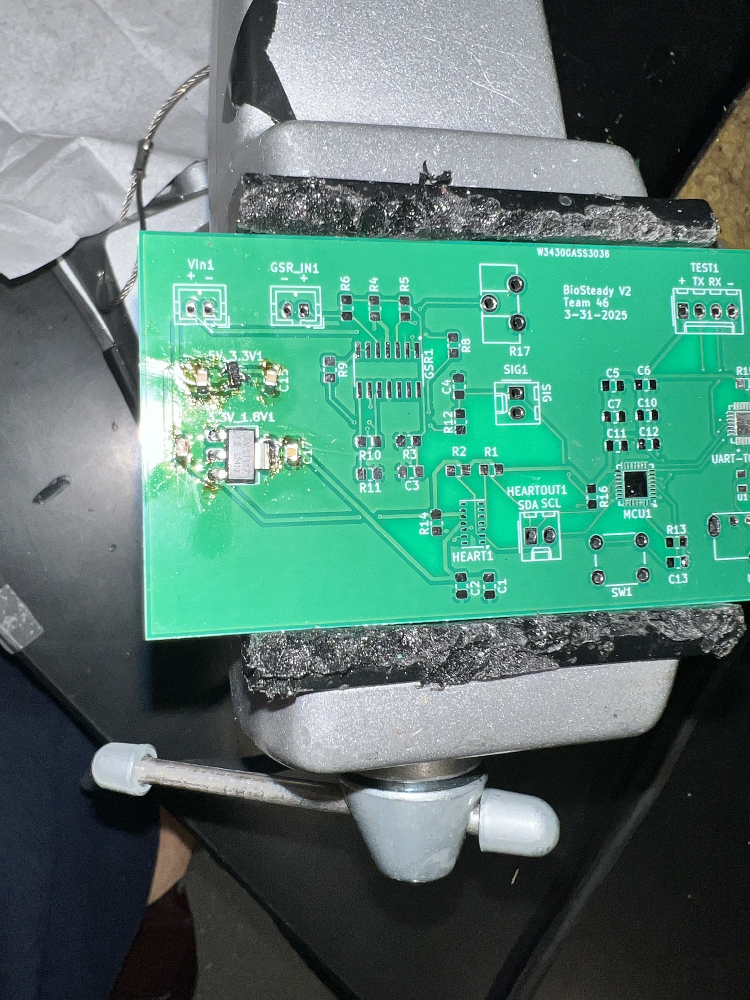

# Alisha Worklog

## 2/12/25 : Research for Proposal

Objective : Find Components for Proposal Components

Our group met last week to discuss what project we wanted to do and got approved for a caffeine detection device. When researching which biosensors would be helpful for this device, I found the MAX30102 heart rate sensor and a GSR sensor. I tasked myself with assembling the PCB board to create a wearable device. I researched what other components we will need for these sensors and found that we need a 5 V power source, 3.3 V power source, and a 1.8 power source. The schematics for both sensors use a LDO voltage regulator so I chose a LM3480-3.3 for the 5V to 3.3V voltage regulator and a ASM1117-1.8 voltage regulator. I proposed to use a STM32 microcontroller since they are compact and are easier to use. Also, the STM32 has all the correct data communication protocols we need for the sensors we are using. Since we are using STM32, then we need a UART-to-USB bridge so I researched different bridges and found the CP2102 which is also compact. Also, I found that a USB-A cable can provide 5V of power so we can use that to provide a 5V power supply.

## 2/18/25 : GSR sensor schematic brainstroming

Objective : Figure out how to incorporate the GSR sensor into design

I am currently looking at the schematics for our PCB design components. The plan right now is to replicate the schematic design for the GSR and heart rate sensor. The following is the breakout board and schematic for the GSR sensor. 

I think I will need to replicate the GSR schematic in our schematic design using a LM324 Op Amp, resistors, and capacitors.

## 2/24/25 : MAX30102 and Microcontroller brainstorming

Objective: Plan the MAX30102 and Microcontroller design for the schematic

Now I am looking at different schematic designs for the MAX30102 chip. This sensor is a chip so I am reading the datasheet to see what the sensor needs and how it works. This is the recommended setup from the datasheet:

I looked on KiCAD and the MAX30102+ is an avaliable part so I will just follow this recommended setup for the schematic design

## 2/27/25 : Inital Assembly for Schematic Design

Objective : Start schematic design

I am now creating a schematic design for our wearable device on KiCAD. This is the current schematic I have: 

## 3/7/25 : Finishing First PCB Design for Second Round PCB Order

Objective : Complete PCB Design for Second Round PCB Order

Since I couldn't meet the first round PCB order, I am now finishing the schematic and layout portion so we can order our PCB. After looking at the datasheet for the voltage regulators, I realized I connected the voltage regulators incorrectly. I also read the datasheet for STM32 microcontroller and CP2102 device and followed the recommended setup for each device. Here is the finished schematic design:

I got a few errors when running DRC on the layout:

But I think these warnings are fine because I am using a a larger LM324 package so some pins will not be needed. 

## 3/12/25 : Changing Schematic after Breadboard Demonstration

Objective : Change Power Subsystem to match requirement

Professor Zhao recommended that we use a separate battery input rather than the 5V input from the USB-A connector since each subsystem should be separate from each other so I changed the power subsystem schematic to instead have a 2x1 molex connector:

## 3/31/25 : Finishing Third PCB Design 

Objective : Complete Third PCB Design

After getting the second round PCB, I realized we need to add the changed to the power subsystem from the breadboard demo. Also, I added more test points for each subsystem. Also, the second round PCB didn't have the correct footprint for the diodes needed in the CP2102 design. Here is the schematic and layout for the second round PCB design:

## 4/7/25 : Assembling and Debugging Second Round PCB

Objective : Start soldering and testing second round PCB

I am starting with our 2nd round PCB design while waiting for our 3rd round PCB design. This is what I have so far: 

I tried testing the power subsystem with the USB cable but I think the cable is just a charging cable not a data cable so it is not supplying 5V to the power subsystem. I soldered wires to the 5V and GND traces of the voltage regulators and used the lab bench power supply to provide the 5V and used a multimeter to test the output of both voltage regulators. They supply 3.3V and 1.8 V so I think the power supply will be reliable if there is a battery input.

I have decided to wait for third rounc PCB to solder every component because we will need to use the third round instead due to the changes to the power and control subsystem. Also, the third round has more test points than the second round.

## 4/12/25 : Assembling and Debugging Third Round PCB

Objective : Start soldering and testing Third round PCB

I am now soldering the third round PCB. I want to make sure each subsystem works before moving onto the next subsystem. So, I am testing the power subsystem right now:

I had to hand-solder the components since this round didn't come with a stencil. 
Here is how I am using the power supply to give power to the subsystem:

Here is the voltage and current display limit I set for the power input:

## 4/13/25 : Assembling and Debugging Heart Rate sensor on PCB

Objective : Solder and test Heart Rate sensor componenent on current PCB setup

Since our power subsystem is fine, I am now soldering the heart rate sensor onto the PCB. The chip is very small, so I learning how to use the PCB oven from the tutorial.

I decided to use the stencil from the second round PCB to add solder paste onto the board since the chip pads on the PCB are very small. Here is the board after I took it out of the PCB oven:

Here are the peripheral components that I hand soldered:

## 4/15/25 : Debugging the Heart Rate Sensor on PCB with breakout board

Objective : Test PCB heart rate sensor setup with MCU breakout board and code used for Breadboard Demo

Asmita and I are now testing the Heart rate sensor on the PCB board with the STM32L432KCU6 breakout board and her heart rate sensor code. And issue we are facing is that the LED is not turning on when connecting the PCB to the 5V power supply and connecting the output to the breakout board IO pins. What should have happened was that the 3.3V power supply to the LED would turn the chip on but this did not happen. I used the multimeter to test if the LED voltage pad was getting 3.3V but I cannot acces the pads underneath the chip. I think the issue is that the 3.3V trace to the LED pad comes from a pull-up resistor for the INT pin which is current limiting the LED. I will need to use a through-hole resistor instead to between INT pin and the 3.3V coming from the AMS1117-1.8 voltage regulator. So, the sensor is currently being detected by the MCU because we made the LED of the breakout board blink if the heart sensor part ID (0x15) was in the correct address. However, the data that the sensor is NULL because the LED is not turned on. 

I tested the voltage input of the pads using a multimeter after taking the chip off the PCB and the pad is getting 3.3V. I think the chip might be broken so I ordered another two Heart rate sensor chips as backup. 

## 4/20/25 : Assembling and Debugging the GSR sensor

Objective : Solder and test GSR sensor setup on current PCB board 

I am now assembling the GSR sensor on the PCB. I am hand-soldering the components. After having a trace issue with the heart rate sensor, I also noticed that the 5V power supply trace for the LM324 Op Amp comes from a pull-up resistor connected to another pin so I instead used a through-hole resistor for this resistor between the pad and the 5V voltage input so that nothing is connected to the 5V pad that is traced to the VDD input. I also soldered the STM32L432KCU6 design and the CP2102 chip onto the PCB using the stencil and the PCB oven. 

I am now testing the input and output voltages for the GSR sensor and the microcontroller after connected the 5V power supply. The GSR sensor is getting a reasonable voltage input of around 2.14 V and has a resistance of in the KOhm range which means the input electrodes are supplying a reasonable voltage. The output is at 3.4 V which is pretty high, but since it is not at or above 5V then the LM324 isn't getting saturated. Using the multimeter, I see that the TX and RX connection are 3.3V from the testing points which means that the microcontroller is powered and idle. 

This means that the power subsystem is good, the GSR sensor design is good, and the microcontroller is good. 

## 4/23/25 : New Approach to Heart Rate Sensor

Objective : Successfully solder Heart Rate sensor onto a new PCB board to turn LED on

I recieved my new heart sensor chips so I am going to use a new board separate from the one I have previously soldered to make sure all the connection are viable for this chip. Instead of just using solder paste, I am hand-soldering each pad because I think the issue last time was that some pads didn't have enough paste on them so components didn't fully connect to the board. 

After hand-soldering each pad, I am now putting flux all over the footprint and then placing the sensor onto the board. I am then putting it into the oven.

After the oven, I soldered a new AMS1117-1.8 voltage regulator to the new board and the peripheral components except the INT pull-up resistor since that was current-limiting the LED voltage input.

After connect the board to a 3.3V power supply, the LED is now functional:

After discussing with the team, I have decided to use this board just for the heart rate sensor and use the original board i was working on for the other components to not mess with this current setup.

I am now testing the original board with our power subsystem and GSR sensor with the breakout board to make sure our GSR sensor outputs the expected values:

It seems to output the values within the expected range so I believe this sensor is working as expected.

## 4/26/25 : Testing Control Subsystem

Objective : Program MCU with Uart-to-USB bridge

I am currently testing the control subsystem to see if the microcontroller and UART-to-USB bridge can interact with each other. This is the current setup:

The component on the right is the CP2102 and the component on the left is the STM32 microcontroller. I need to download the CP2102 Mac driver from the Silicon Lab website: https://www.silabs.com/developer-tools/usb-to-uart-bridge-vcp-drivers 

After connected the power supply to the setup above and connecting a USB-A cable to USB connector, I connected the USB cable to my computer. An issue I am experiencing is that my computer is recognizing the usb-c input as a device but I cannot access the device, which means it is likely a driver issue. 

I am now trying to see if the driver is correctly downloaded onto my computer. However, the issue is that I recently updated my computer OS so my computer isn't fully enabling the website extension for some reason. 

After speaking with the team, we think the issue is that newer version of macbooks have issues with the CP2102 website extension so I am not able to access the CP2102 device. So, I am going to use a HiLetGo UART-to-USB bridge in the meantime to connect the microcontroller to my computer. 

Here is the setup using the HiLetGo board: 

I am using the STM32Programmer to program to STM32MCU to output a simple "Hello" string to test if the MCU can successfully send data to my computer. This is the successful output of the test:

## 4/28/25 : Assembling Final PCB Board

Objective : Combine final PCB setup, Test data outputs, Integrate final design with front-end design

After confirming that each subsystem works, I am going to connect all components together. Here is the final PCB setup:

The top PCB board has the power subsystem, the GSR sensor, and the STM32 microcontroller. The bottom PCB has the heart rate sensor, with the red LED showing that the sensor is being correctly powered. I programmed the device using the microcontroller unit software that Asmita used for our Breadboard Demo. This is what the microcontroller send my computer when connecting my computer to the PCB setup:

The Value = "" is the analog voltage output signal from the GSR sensor and the RED and IR values come from the heart rate sensor. I confirmed these output by testing the voltage output coming from the analog voltage test signal out of the GSR sensor (Vsignal) and it matches with what is showing on the screen where the ADC value is calculated by doing the following: Value = ((Vsignal) / 3.3V) * 4095. I put my fingers in the input electrodes after connecting my computer which is why the value is initially 4095. After I out my fingers in the electrode, the value drops to 3735 and keeps decreasing, with slight spikes, which is a good sign because the sensor is a forward-feeding loop. The heart rate sensor also look good after I put my finger above the sensor during the same time as I put my fingers in the electrodes because it spikes then decreases, which is the expected behavior of the heart rate sensor.

I met with the team to integrate this PCB design with the front-end device by running the python script to collect and transfer the physiological data collected by the PCB to Firebase. This successfully worked. Due to time and budget constraints, I am now creating a enclosure out of cardboard for the battery and PCB board. This is the final product:

 
