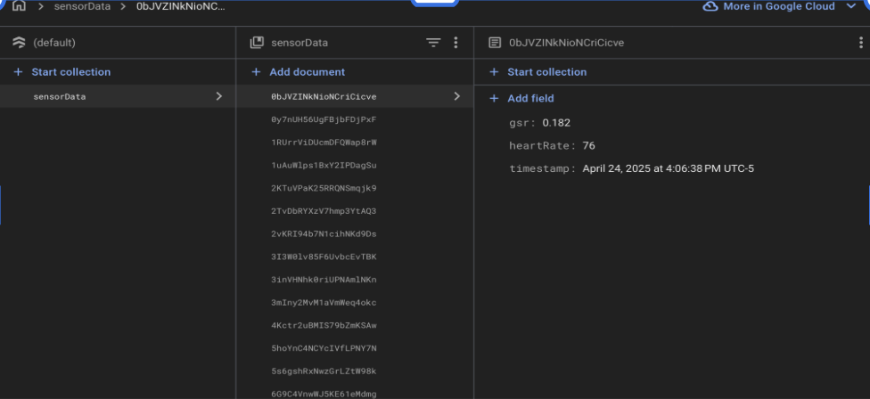
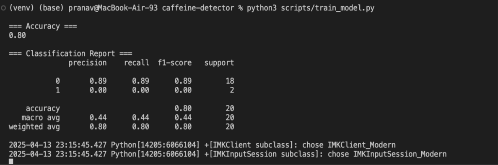
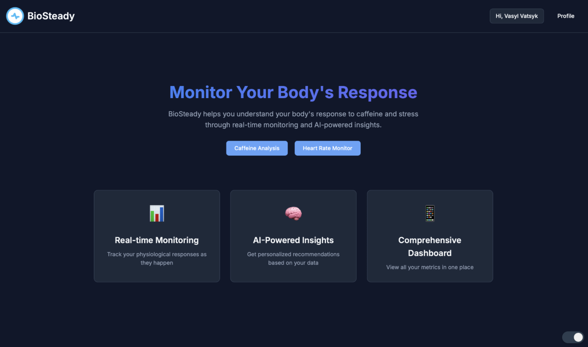
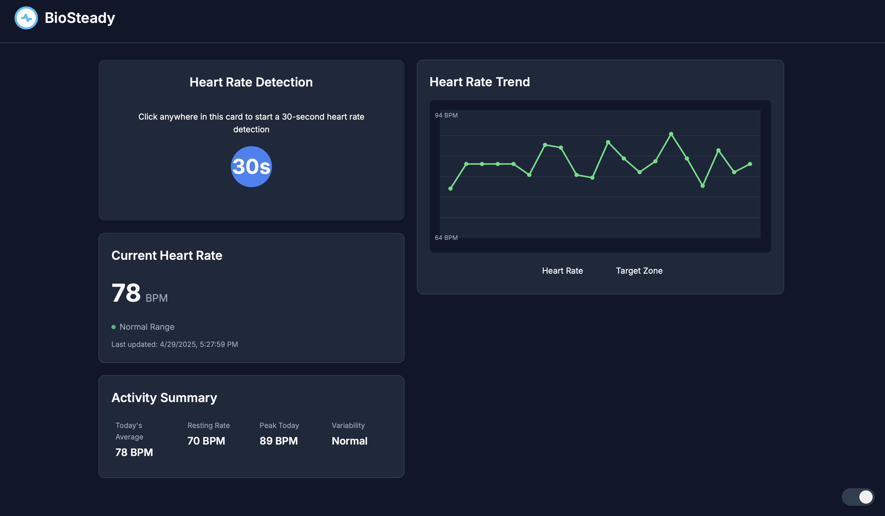
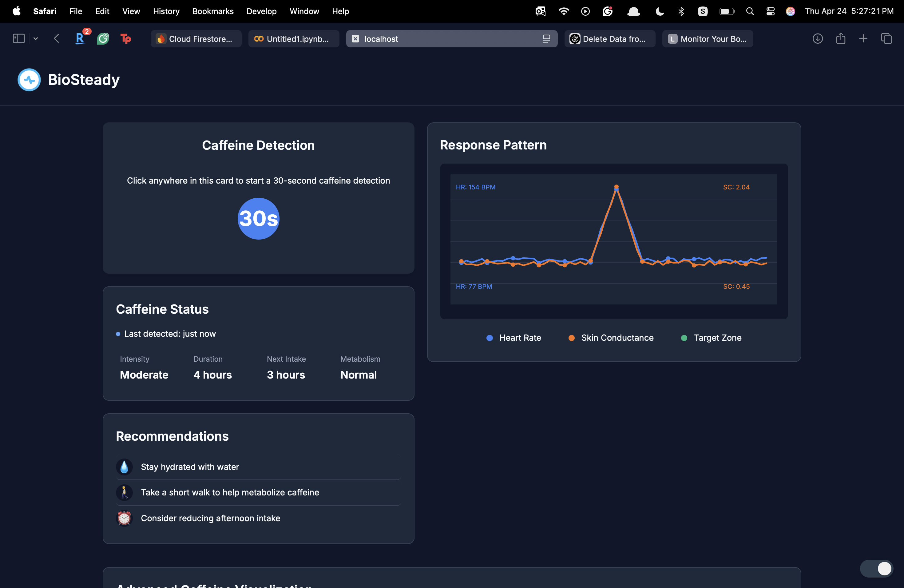

# Pranav Worklog

### Table of Contents
- [2025-01-24 – Project Kickoff](#2025-01-24--project-kickoff)
- [2025-02-05 – Firebase Integration](#2025-02-05--firebase-integration)
- [2025-02-17 – Biometric Logging  Manual Caffeine Labeling](#2025-02-17--biometric-logging--manual-caffeine-labeling)
- [2025-03-01 – ML Stage 1 Feature Planning  Hospital Data](#2025-03-01--ml-stage-1-feature-planning--hospital-data)
- [2025-03-10 – ML Stage 2 Personal Data Vectorization](#2025-03-10--ml-stage-2-personal-data-vectorization)
- [2025-03-15 – ML Stage 3 KNN Classifier Build](#2025-03-15--ml-stage-3-knn-classifier-build)
- [2025-03-22 – ML Stage 4 Classifier Optimization](#2025-03-22--ml-stage-4-classifier-optimization)
- [2025-03-29 – Frontend Development BioSteady UI](#2025-03-29--frontend-development-biosteady-ui)
- [2025-04-13 – Final Model Evaluation](#2025-04-13--final-model-evaluation)
- [2025-04-24 – Synthetic Dataset Generation](#2025-04-24--synthetic-dataset-generation)
- [2025-04-29 – Final Demo](#2025-04-29--final-demo)
- [2025-05-06 – Final Presentation](#2025-05-06--final-presentation)

---

# 2025-01-24 – Project Kickoff  
Outlined the goal: build a caffeine detection system that uses biometric sensors (GSR & heart rate) to estimate caffeine’s physiological effect. Decided on using a custom PCB for data collection, Google Firebase for cloud storage, and a KNN-based ML model trained on hospital data. The key outcome was establishing the full data flow concept: **PCB → Python → Firebase → ML → Frontend**.

---

# 2025-02-05 – Firebase Integration  
Set up Google Firebase Firestore and configured authentication with a service key. Built a Python script to read serial data over USB from the PCB and log it to Firestore. Each document included:
- `gsr`: Galvanic skin response (µS)
- `heartRate`: beats per minute (BPM)
- `timestamp`: Local time with timezone offset  
Tested write operations, ensured structured formatting for later analysis, and set the foundation for real-time cloud syncing.

---

# 2025-02-17 – Biometric Logging + Manual Caffeine Labeling  
Collected initial data manually by drinking measured quantities of coffee and recording the time, amount, and follow-up sensor readings at 5, 10, 15, and 20-minute intervals. Simulated real-world use by:
- Tagging intake points in the dataset
- Observing real-time GSR/HR trends on the Firebase dashboard  
This session helped validate that the sensor data reflected biological changes post-ingestion and would be usable in ML feature extraction.

---

# 2025-03-01 – ML Stage 1: Feature Planning & Hospital Data  
Analyzed hospital datasets that included time-series GSR and HR values with known caffeine doses. Selected five core features:
- ΔGSR: max change post-ingestion
- ΔHR: heart rate spike
- Time-to-peak: time to maximum response
- Recovery time: return to baseline
- Caffeine dosage (estimated per cup: ~95mg)  
Defined a weight function using linear combinations of these values. Normalized data to make it consistent with future test vectors.

---

# 2025-03-10 – ML Stage 2: Personal Data Vectorization  
Converted manually labeled sessions into the same 5D format. Used peak detection to extract ΔGSR and ΔHR, calculated time-to-peak and recovery based on rolling averages. This established compatibility between personal and hospital data, enabling supervised classification.

---

# 2025-03-15 – ML Stage 3: KNN Classifier Build  
Implemented a K-Nearest Neighbors classifier (k=3). Input: personal test feature vector. Distance metric: Euclidean.  
For each prediction, the model identified the 3 closest vectors from the hospital dataset and output:
- Estimated caffeine effect duration
- Suggested next safe caffeine intake time  
Model inference was done using custom Python code (not a framework like scikit-learn) to allow weight tuning and better insight into neighbor comparisons.

---

# 2025-03-22 – ML Stage 4: Classifier Optimization  
Tuned weight coefficients in the vector function:
- Boosted importance of ΔHR and Recovery Time
- Reduced Time-to-Peak impact  
Improved clustering around high-dose events. Added logic to dynamically retrain the model over time with new user data, making it **adaptive to each user’s biometrics**. Observed that repeated usage improved prediction consistency.

---

# 2025-03-29 – Frontend Development: BioSteady UI  
Developed a responsive React frontend with three key views:
- **Landing Page**: Personalized welcome, explains real-time detection and adaptation to the user’s physiological profile.
- **Heart Rate Monitor**: Live HR values + 30s trend. Used to establish a user's baseline over time.
- **Caffeine Detection Page**: Runs a short scan, plots GSR & HR spikes, and shows estimated effect duration + next safe caffeine window.  
Also added a recommendation engine: hydration tips, pacing suggestions, and safe re-intake timings.

  
  

---

# 2025-04-13 – Final Model Evaluation  
Evaluated the model using the **full hospital dataset**. Final classifier accuracy was **80%**, benchmarked against a research-reported ~83%. This was considered a strong result given the personalization aspect. Results confirmed that KNN was effective due to the model’s simplicity and explainability in a low-sample, profile-specific setting.

---

# 2025-04-24 – Synthetic Dataset Generation  
Generated a realistic hospital-style dataset for demo purposes. Added timestamped caffeine events, modeled GSR and HR spikes 3–5 minutes after ingestion. Spikes capped at ~2.0 µS (GSR) and 100 BPM (HR). Used the dataset to:
- Demonstrate training logic  
- Feed the frontend for display  
- Test the model’s ability to generalize from unseen, realistic sequences

---

# 2025-04-29 – Final Demo  
Live demo of full system:
- PCB streamed real-time biometric data to Firebase
- Manual caffeine input triggered feature extraction and classification
- Frontend displayed spike detection and AI-driven predictions  
Explained the weight function and KNN logic to evaluators. Demo confirmed that system was functional, responsive, and accurate with labeled personal data.

---

# 2025-05-06 – Final Presentation  
Delivered final project presentation. Walked through:
- Architecture: PCB, Cloud, ML, UI
- Data pipeline and Firebase integration
- ML model design, tuning, and evaluation results
- Synthetic dataset use and personalization advantages  
Also discussed possible future improvements: automated tagging, time-series models (LSTM), and mobile app extension.
