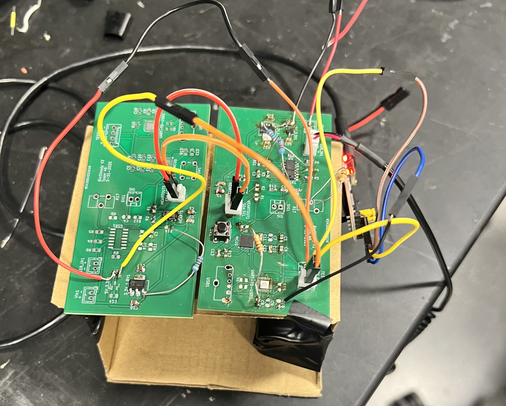
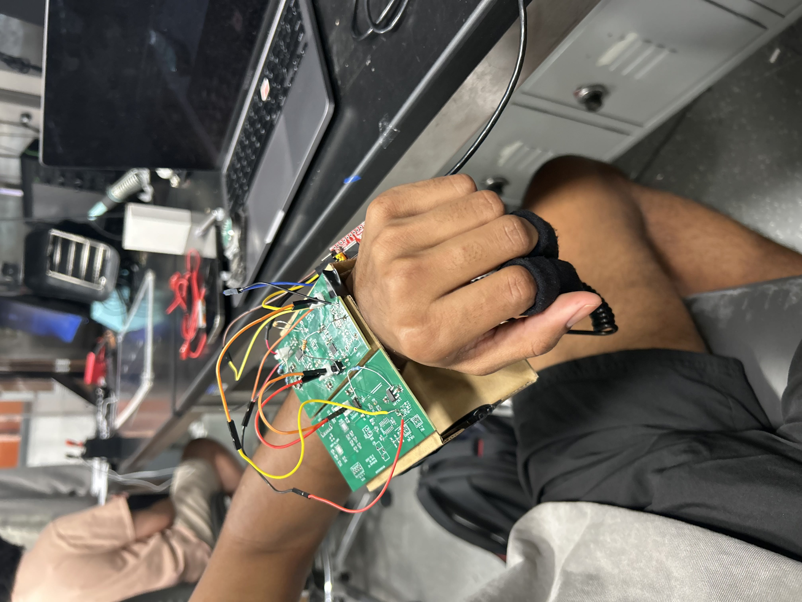
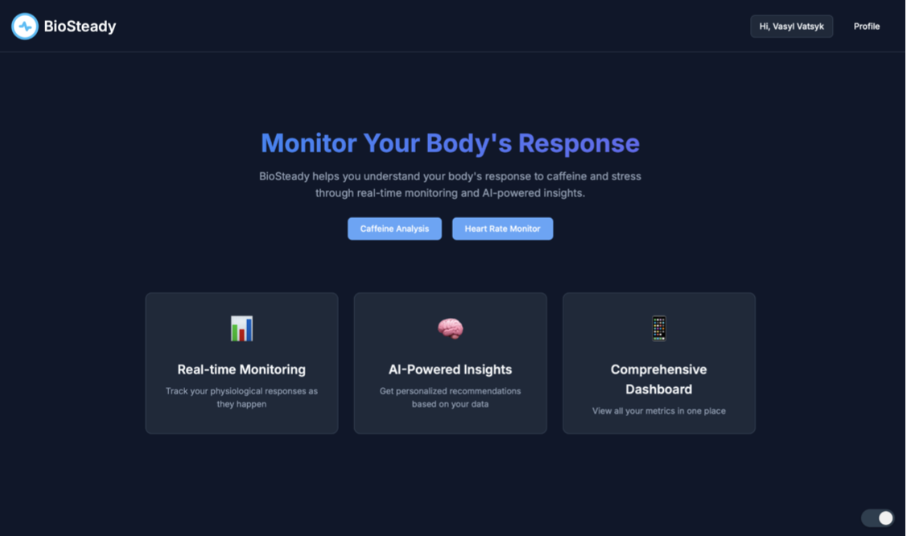
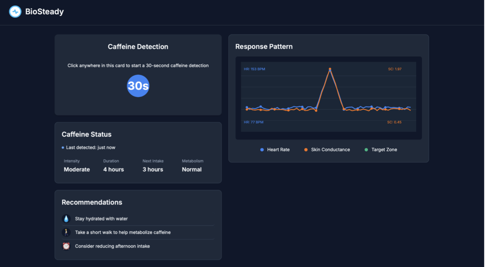
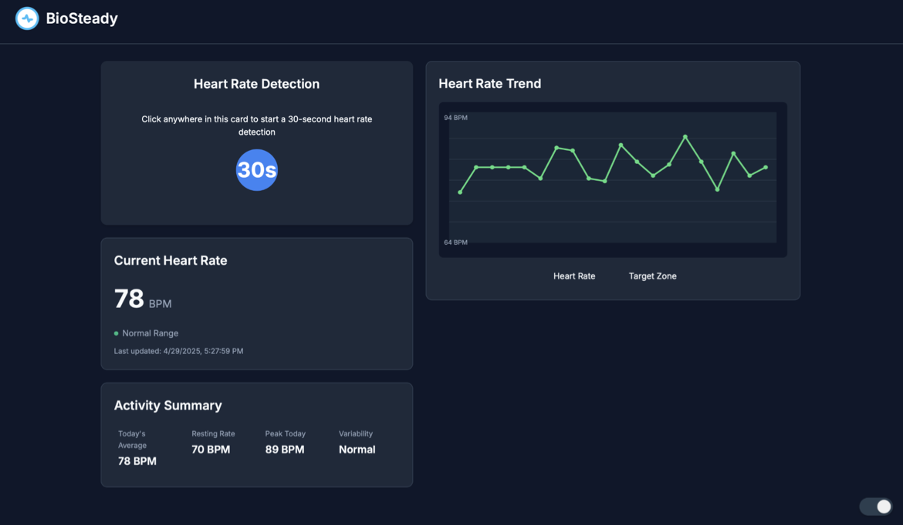

# BioSteady

The goal of this project is to help users assess their physiological reactions to caffeine by measuring changes in heart rate and skin conductance. To influence a positive change in lifestyle, we wanted to use our device to also provide users with actionable feedback so they can practice making informed decisions about their daily caffeine intake levels.
## Team Members:

Alisha Chakraborty (alishac4)

Asmita Pramanik (asmitap2)

Pranav Nagarajan (pranavn6)

## Results

[Demo](https://youtube.com/shorts/EtUrvZClkEc?feature=shareV)

### Wearable Device

## Web Application

