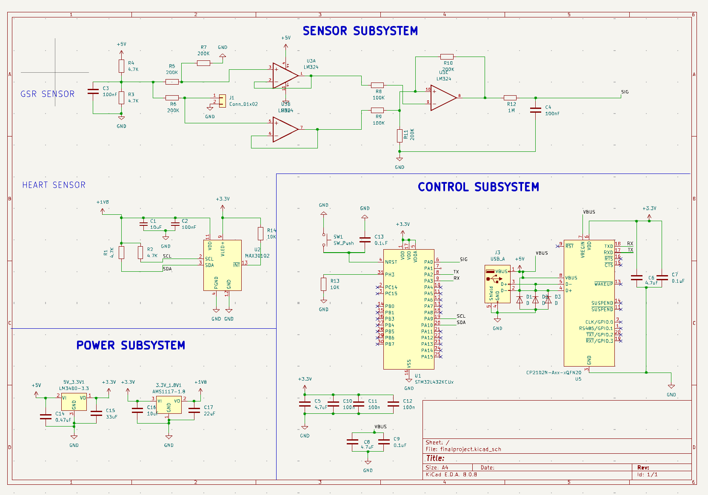
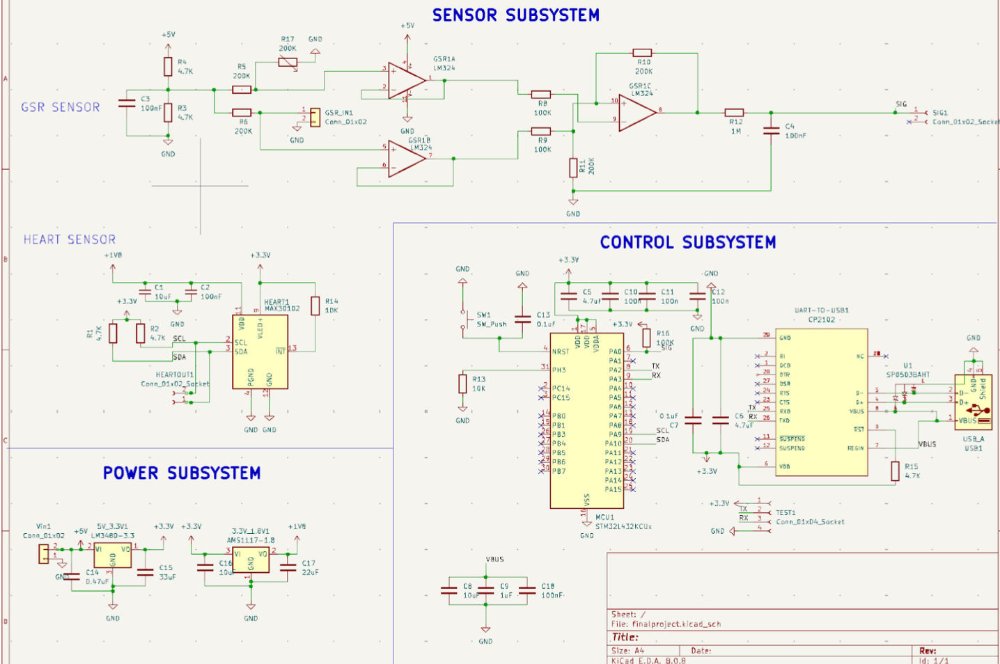

# BioSteady : PCB Design

This is the ECE445 BioSteady Github Lab notebook Repo for the PCB boards . 

This repo consists of 3 PCB designs. Our first PCB design is Team46V2.zip and V2Gerver, our second PCB design is Team46V3.zip and V3Gerver, and our third and final design is Team46Final.zip and V4Gerber. The following images are the schematic diagrams for each design.

## PCB Components:

### Power Subsystem

- [LM3480-3.3](https://www.ti.com/general/docs/suppproductinfo.tsp?distId=10&gotoUrl=https%3A%2F%2Fwww.ti.com%2Flit%2Fgpn%2Flm3480)
- [AMS1117-1.8](https://mm.digikey.com/Volume0/opasdata/d220001/medias/docus/6782/5272_AMS1117-1.8%20SOT-223-3.pdf)

### Sensor Subsystem

- [MAX30103 Pulse Oximeter Sensor](https://www.analog.com/media/en/technical-documentation/data-sheets/max30102.pdf)
- [GSR sensor](https://wiki.seeedstudio.com/Grove-GSR_Sensor/)

### Control Subsystem

- [SMT32L432KCU6 MCU](https://www.st.com/resource/en/datasheet/stm32l432kb.pdf)
- [CP2102 UART-to-USB](https://www.silabs.com/documents/public/data-sheets/CP2102-9.pdf)

## First PCB Design:

## Final PCB Design (used in second and third PCB design):

